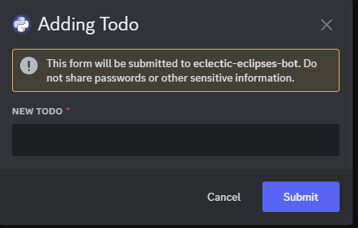

# Features

All the features provided to the bot have the documentation here

## Contents

- [ToDo app](#ToDo)
- [Dictionary](#Dictionary)
- [Calculator](#Calculator)
- [Reminder](#Reminder)

## ToDo

Commands present in ToDo:

- /todo add - Used to add an item to the ToDo list
- /todo remove - used to remove an item from the ToDo list
- /todo list - Used to list down all the items from the ToDo list
- /todo gui - Used to invoke the GUI for the ToDo list

### Show ToDos with button interaction

### Add ToDo via context menu

## Dictionary

Commands present in Dictionary:
- /dictionary
You can run the command using /dictionary {SEARCH_WORD}
This will give a short definition of the word
If the word is not present in the dictionary it will provide a list of words similar to the search word and you can run the  dictionary command on those word

## Calculator

### Commands present in Calculator:

#### Info commands

- /calc_help - Get a list of available calculator commands
- /calc_info - Get information about the calculator
- /calculator - Open the interactive calculator, can be used to open up the GUI for the interactive calculator you can use in chat itself

#### Calculate commands

- /calculate expression [expression] - Calculate a mathematical expression
- /calc sqrt [x] - Calculate the square root of x
- /calc root [x] [n] - Calculate the nth root of x
- /calc ln [x] - Calculate the natural logarithm of x
- /calc log [x] [base] - Calculate the logarithm of x with a specified base
- /calc exp [x] - Calculate the exponential of x
- /calc fact [x] - Calculate the factorial of x
- /calc rad [x] - Convert a degree value into radians
- /calc deg [x] - Convert a radians value into degree
- /calc_trig basic [function] [angle] - Calculate basic trigonometric functions
- /calc_trig inverse [function] [value] - Calculate inverse of basic and hyperbolic trigonometric functions
- /calc_trig hyperbolic [function] [value] - Calculate hyperbolic trigonometric functions
- /calc_trig other [function] [angle] - Calculate other trigonometric functions

### Calculator with button interaction

## Reminder

- /remindme at - Adds an alarm at a specific date and time
- /remindme in - Adds a reminder for after an specific amout of time
- /set timezone - Sets the timezone, based on which remindme command can remind you

